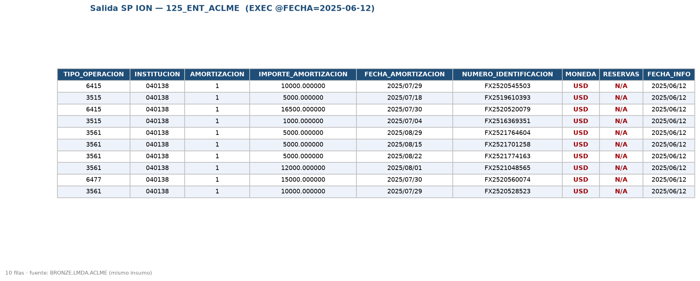
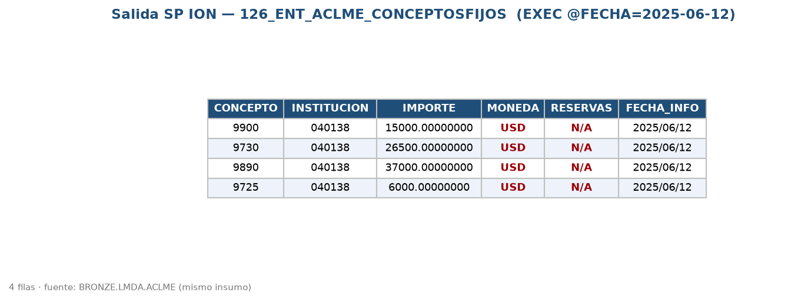

# Notas para el usuario final — Reportes ACLME 125 y 126

Ambos reportes se generan **diariamente** y usan **el mismo insumo** (`BRONZE.LMDA.ACLME`, el archivo de tesorería), pero lo presentan de dos maneras distintas:

- **125 · ENT_ACLME** — detalle por operación (una fila por movimiento reportado).
- **126 · ENT_ACLME_CONCEPTOSFIJOS** — resumen: **suma de montos agrupada por "concepto"**.

A continuación, los puntos que conviene tener presentes al leer/validar la salida.

---

## 1. `RESERVAS` se muestra como **"N/A"** (aunque el campo es numérico)
En la base se guarda **`0`** (la columna es numérica), pero en la **salida del reporte** se presenta el texto **`"N/A"`**. Es intencional: el layout pide "N/A" pero el almacenamiento debe ser numérico.
- Aplica a **125** (siempre) y a **126** (para sus conceptos 9725/9730/9890/9900).

## 2. `MONEDA` siempre sale **"USD"**
En la salida, la moneda es **constante `USD`**, sin importar la moneda original de la operación (MXN/USD). La moneda original **sí se usa** internamente para clasificar (posición/concepto), pero el reporte se entrega en USD.

## 3. `INSTITUCION` — clave por cliente, con ceros a la izquierda
- Es un **valor fijo por cliente** (la institución que reporta). En los ejemplos usamos `40138` como placeholder → **se debe reemplazar por la clave real del cliente**.
- En la salida se presenta como **texto de 6 posiciones con ceros a la izquierda** (p. ej. `040138`).
- **126:** la información **NO se agrupa por institución** (se asume una sola institución por corrida); si en el futuro llegan varias, habría que revisar esta regla.

## 4. Operaciones que **no se reportan** (se excluyen)
- **125:** se excluyen operaciones con **plazo menor a 1 día** (cuando la fecha de inicio es igual o anterior a la fecha del reporte). Ej.: una operación que inicia el mismo día del reporte no se reporta.
- **126:** se excluyen los movimientos que **no caen en ningún concepto** (ver punto 5).

## 5. Tratamiento de **Swaps (SW)** — tal cual las reglas de negocio
- **125:** un swap (SW) se trata como **spot** para efectos de la clave.
- **126:**
  - SW en **USD** → cuenta como **Compra de Spots (9725)**.
  - SW en **MXN** → **no cae en ningún concepto → se descarta**.
  - Por eso los conceptos de swaps (**9895 / 9910**) **nunca aparecen** en el reporte.

## 6. Fechas
Todas las fechas de la salida se presentan en formato **`AAAA/MM/DD`** (p. ej. `2025/06/12`).

## 7. Qué se agrega en **126** (conceptos)
Se suma el **MONTO** agrupado por concepto, asignado según **moneda + tipo de operación**:

| Moneda | Tipo | Concepto | Descripción |
|---|---|---|---|
| USD | SW o FX | 9725 | Compras de Spots |
| MXN | FX | 9730 | Ventas de Spots |
| USD | FW | 9890 | Compras de Forwards |
| MXN | FW | 9900 | Venta de Forwards |

Ejemplo validado (insumo de 11 movimientos): 9725=6,000 · 9730=26,500 · 9890=37,000 · 9900=15,000.

---

## Capturas de la salida (mismo insumo, dos presentaciones)

**125 · ENT_ACLME** — detalle por operación:

**126 · ENT_ACLME_CONCEPTOSFIJOS** — resumen por concepto:

> En rojo se resaltan `MONEDA = USD` (constante) y `RESERVAS = N/A` (fijo). Ambas salidas provienen del **mismo** `BRONZE.LMDA.ACLME`.

---

## Notas técnicas (para el área de datos)
- **Columnas auxiliares** en SILVER (para auditoría, **no** salen en el reporte): en 125 `PLAZO, OPERACIONES_A_REPORTAR, POSICION_OPERACION, LLAVE`; en 126 `DESCRIPCION, MOVIMIENTOS`.
- **Catálogos en BRONZE** (equivalencias externalizadas, sin hardcodeo): `CATALOGO_TIPO_OPERACION_ACLME` (125) y `CATALOGO_CONCEPTOS_PLAZO_FIJO_ACLME` (126). Cambiar una equivalencia = editar el catálogo, sin redesplegar el SP.
- **Alcance diario**: cada corrida procesa el lote del día (por `FECHA_EXTRACCION` = fecha del reporte) y es idempotente (reemplaza la salida de ese día).
- **`IMPORTE` en 126** es `numeric(15,8)` (máx. 7 dígitos enteros): los montos deben caber en ese rango.
